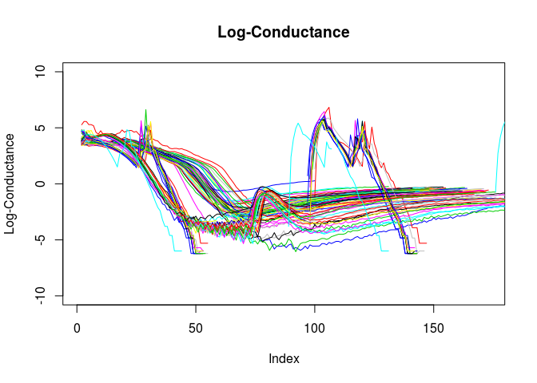

R Markdown
----------

Preliminary README document, it will grow as the library grows.

Example Code to Generate Plot
-----------------------------

    library(rDecentEspresso)

    filesVector <- list.files(path)

    #Filter for .shot files
    filesVector <- filesVector[which(sapply(gregexpr("shot",filesVector),`[`,1)>0)]

    #Import .shot files
    dataList <-
    lapply(filesVector
           , function(fileName){
             fileData <- importShotFile(paste0(path,fileName))
             return(fileData)
           }
           )

    #check if any had errors
    all(sapply( dataList,class) == "matrix")

    ## [1] TRUE

    #calculate resistance and conductance
    dataList <- lapply(dataList,calculateResistance)
    dataList <- lapply(dataList,calculateConductance)

    #plot them all
    plot(log(dataList[[1]][,"espresso_conductance"]),type="l",col=2,ylim=c(-10,10), ylab="Log-Conductance", main="Log-Conductance")
    for(x in 2:length(dataList)){
      lines(log(dataList[[x]][,"espresso_conductance"]),type="l",col=x)
    }

